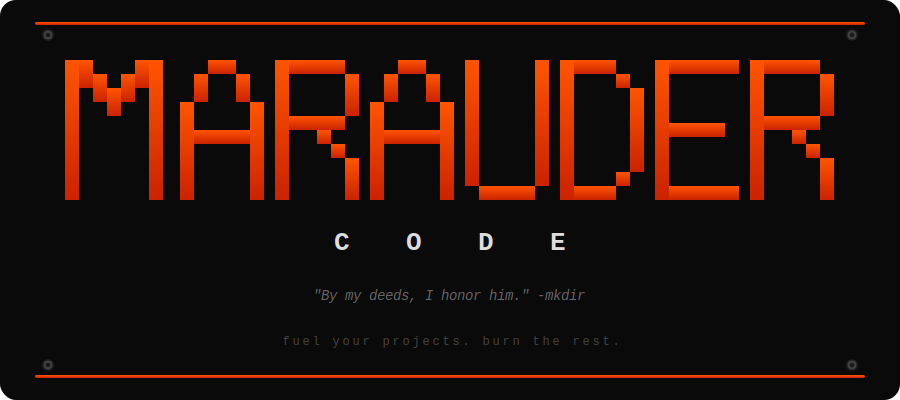
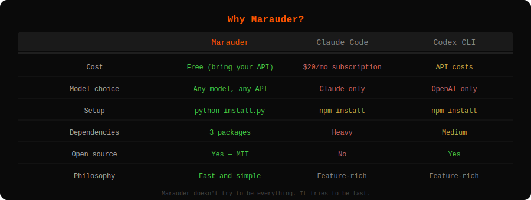
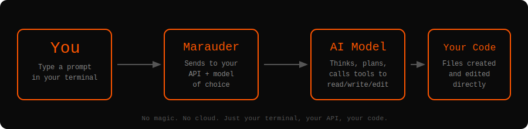
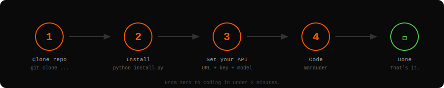
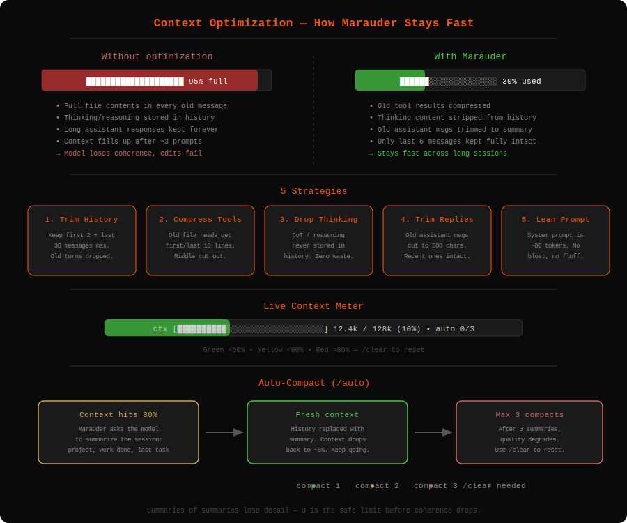

<p align="center">
  
</p>

<p align="center">
  Open source AI coding CLI — the no-BS alternative to Claude Code and Codex CLI.
</p>

<p align="center">
  <a href="#why-marauder">Why</a> •
  <a href="#how-it-works">How it works</a> •
  <a href="#context-optimization">Context</a> •
  <a href="#installation">Install</a> •
  <a href="#usage">Usage</a> •
  <a href="#contributing">Contributing</a>
</p>

---

## The pitch

You don't need a $20/month subscription to code with AI in your terminal. You don't need to be locked into one provider. You don't need 200 dependencies.

You need something that takes your prompt, talks to an AI, and writes the damn code. That's Marauder.

**Bring your own API. Pick your model. Type what you want. Get code.**

No fancy features. No plugin system. No config files with 47 options. Just a terminal, a prompt, and results.

---

## Why Marauder?

<p align="center">
  
</p>

Marauder doesn't try to compete on features. It competes on **simplicity** and **speed**.

- **3 dependencies.** That's the entire stack. `openai`, `rich`, `prompt_toolkit`.
- **Any model.** OpenAI, Ollama, OpenRouter, LM Studio, local models — if it speaks the OpenAI API format, it works.
- **No lock-in.** Your API key, your endpoint, your choice. Switch models between sessions if you want.
- **Fast inference loop.** Minimal overhead between your prompt and the model. No middleware, no telemetry, no abstractions eating your tokens.

---

## How it works

<p align="center">
  
</p>

You type a prompt. Marauder sends it to your AI model. The model decides what to do — read files, write code, edit existing files, run commands. Marauder executes those actions in your project directory. Done.

The AI has 5 tools:
| Tool | What it does |
|------|-------------|
| `read_file` | Read any file in your project |
| `write_file` | Create or overwrite a file |
| `edit_file` | Find-and-replace edit in a file |
| `list_files` | Explore directory structure |
| `run_command` | Run shell commands |

That's the entire toolset. No sandboxes, no virtual environments, no Docker containers. It works directly on your files, like you would.

---

## In action

<p align="center">
  
</p>

---

## Installation

<p align="center">
  
</p>

```bash
git clone https://github.com/Ciel2006/Marauder.git
cd marauder-code
python install.py
```

The installer:
- Installs the 3 Python dependencies if missing
- Registers `marauder` as a global command
- Tells you if you need to add anything to your PATH

Works on **Windows**, **Linux**, and **macOS**.

**Requirements:** Python 3.10+

---

## Usage

```bash
marauder
```

First time? It'll ask for your API details:

```
API Base URL: https://api.openai.com/v1
API Key: sk-...
Model ID: gpt-4o
```

Config gets saved to `~/.marauder_config.json` — reused next time automatically.

Then pick your working directory, choose a view mode, and start prompting.

### View modes

- **Normal** — single-line progress bar with live timer. Clean. You see the result when it's done.
- **Advanced** — see every tool call live with syntax-highlighted code panels.

Toggle anytime with `/mode`.

### Commands

| Command | What it does |
|---------|-------------|
| `/quit` | Exit |
| `/clear` | Reset conversation context |
| `/mode` | Switch between normal/advanced view |
| `/auto` | Toggle auto-compact (summarize at 80%, max 3x) |

---

## Context Optimization

<p align="center">
  
</p>

Most CLI coding tools choke after a few prompts because the context window fills up with old file contents and verbose responses. Marauder doesn't.

Five strategies keep your context lean:

1. **History trimming** — only the last 40 messages survive. Old turns get dropped.
2. **Tool result compression** — old file reads keep only the first and last 10 lines. The middle gets cut.
3. **Thinking content dropped** — chain-of-thought from models like Claude, DeepSeek R1, and Kimi K2.5 is displayed but never stored in history. Zero wasted tokens.
4. **Old replies trimmed** — assistant messages older than 6 turns get cut to 500 chars.
5. **Lean system prompt** — ~80 tokens. Says what it needs to, nothing more.

When all that isn't enough, `/auto` enables auto-compact: at 80% context usage, Marauder asks the model to summarize the session (project, work done, last task), then starts fresh with just the summary. Up to 3 compactions per session — after that, summaries of summaries start losing detail, so it tells you to `/clear`.

A live context meter shows your usage before every prompt so you always know where you stand.

---

## Philosophy

Marauder is built on one idea: **the best tool is the one that gets out of your way.**

No auto-updates. No analytics. No "smart" features that second-guess you. No approval prompts before every file write. No 30-second startup time.

You type what you want. It does it. You move on.

If that sounds good to you, welcome aboard.

---

## Contributing

PRs welcome. Keep it lean. If a feature doesn't make the tool faster, better or simpler, it probably doesn't belong. 

## License

MIT

---

<p align="center">
  <em>"I'll just burn this world to ash, then run in cry"</em>
</p>
